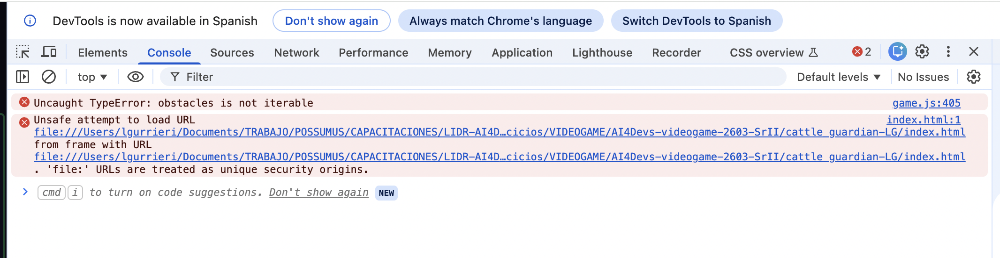

# Tools 
**IDE**: VSCode with Github Copilot

**Model**: Claude Opus 4.6 

# Prompts for Cattle Guardian game development
## First prompt:

Develop a complete JavaScript game called Cattle Guardian (inside cattle_guardian-LG folder) that runs in a web browser. No external libraries, just pure JavaScript and modern HTML5 browser apis. Place everything in a single HTML file, referencing a separate JavaScript and CSS file for simplicity. Here are the detailed requirements and structure for the game:  

1 **Game overview** 

Cattle Guardian is a simple 2D game where a shepherd, represented by a + symbol, protects a cattle sheep from wolves, putting obstacles between wolves and the sheep that move to the barn. 

All the sheep are saved only after the last sheep crosses the dotted line of the barn.

2 **Technical requirements**
- Use plain JavaScript without external libraries.
- Use modern neon lines and shapes to represent the game elements.
- Use modern HTML5 APIs for rendering and game logic, such as the Canvas API for drawing and requestAnimationFrame for smooth animations.
- Ensure compatibility with major browsers (Chrome, Firefox, Safari).
- Implement responsive design to ensure the game is playable on various screen sizes, including desktops, tablets, and mobile devices.
- Include sound effects for actions such as moving, creating obstacles, and game over, using the Web Audio API for an immersive gaming experience.

3 **Game components**
- A game area represented by a rectangle.
- A shepherd that starts at the left side of the game area.
- Wolves that spawn at random locations on the right side of the game area.
- Sheep that spawn at random locations on the left side of the game area.
- A barn represented by a dotted line on the right side of the game area.
- A score counter displaying the number of sheep saved.

4 **Functionality**
- Arrow keys control the shepherd's movement at 1x speed.
- Wolves move at 0.75x speed and change direction after 3 moves.
- Sheep move at 0.5x speed downwards and can be pushed horizontally by the shepherd.
- Clicking the mouse creates an obstacle line from the shepherd's current position to the next click position.
- Wolves cannot pass through obstacles, but sheep can.
- The game ends when a wolf collides with a sheep or the shepherd, or when all sheep are saved.
- Display a "Game Over" message when the game ends, along with the final score. 

5 **Styling**
- Use neon colors to represent the game elements: bright green for the shepherd, bright blue for the sheep, bright red for the wolves, and a bright yellow for the barn.
- Ensure the game is visually clear and plays well on a range of screen sizes.
- Use a dark background to enhance the neon effect.
- Use simple geometric shapes to represent the game elements, such as circles for sheep and X shapes for wolves, and a plus symbol for the shepherd.
- Show the score counter prominently on the screen.

## Second prompt: 

I had this error in chome console: 

## Third prompt:
Some changes to correct:

1. The sheep should be a finite number and must move along the left side, but now from top to bottom and reappear from bottom to top.
2. The wolves cannot cross to the right of the dashed line that marks the barn's boundary, because they would be inside the barn.

Also, to make the game more entertaining:

1. The obstacles last 5 seconds and the sheep can cross them.
2. If the shepherd touches a sheep on its left side, it gives it a horizontal boost of 2x speed towards the barn.
3. If a wolf touches an obstacle, it freezes for 15 seconds and then starts moving slowly for the first 5 seconds.

## Fourth prompt:

I tested it and everything you asked for is OK except for these points:

The sheep keep falling from top to bottom. I made it clear that they should reappear from bottom to top and be a finite number: let's say 20 sheep.

I told you that when the shepherd touches a sheep on the left, it should gain a lot of momentum and follow a horizontal trajectory from left to right at high speed until it enters the barn. Once it crosses the line, it should stop and stay inside the barn. The score should then register as a saved sheep.

If a wolf intercepts a sheep, it's not game over yet. It's only game over if the wolves manage to capture 40% of the sheep.

Make these changes one at a time and don't mark anything as solved until I give you my final confirmation.

## Fifth prompt:

 No, the sheep do have to reappear. Once the last sheep crosses the upper boundary of the canvas, or vice versa, they all reappear in the opposite direction, like a bounce. Correct that, please.

## Sixth - Eighth prompt: 
It' s OK. Let's move forward with the next change. But remember, you have to wait for my confirmation that everything is OK before I mark it as resolved.

